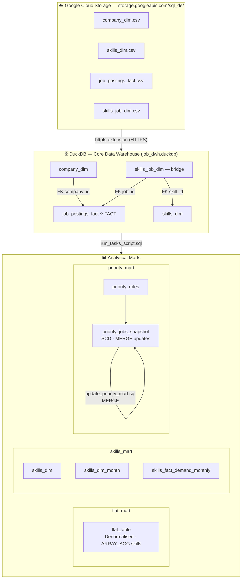

Job Postings DWH — DuckDB + Google Cloud Storage

A fully local, file-based data warehouse and analytics mart pipeline built with **DuckDB**, ingesting raw CSV data directly from **Google Cloud Storage (GCS)**. The pipeline transforms raw job posting data into three purpose-built analytical marts.

---

## 📁 Project Structure

```
.
├── run_tasks_script.sql       # Master orchestration script — runs all steps in order
├── create_table_dwh.sql       # Step 1 — DDL: create DWH core tables
├── load_data_into_dwh.sql     # Step 2 — ETL: load data from GCS into DWH
├── create_flat_mart.sql       # Step 3 — Build flat_mart (denormalised wide table)
├── create_skills_mart.sql     # Step 4 — Build skills_mart (skill demand analytics)
├── create_priority_mart.sql   # Step 5 — Build priority_mart (role priority snapshot)
└── update_priority_mart.sql   # Step 6 — Incremental MERGE into priority snapshot
```

---

## 🚀 Quick Start

### Prerequisites

- [DuckDB CLI](https://duckdb.org/docs/installation) installed
- Internet access (to fetch CSVs from GCS)

### Run the full pipeline

```bash
duckdb job_dwh.duckdb
```

Then inside the DuckDB shell:

```sql
.read run_tasks_script.sql
```

This single command executes all steps in order — from schema creation through to mart population.

---

## 🏗️ Architecture Overview



### Data Sources (Google Cloud Storage)

Raw CSV files are read directly over HTTPS using DuckDB's `httpfs` extension:

| File | GCS URL |
|---|---|
| `company_dim.csv` | `https://storage.googleapis.com/sql_de/company_dim.csv` |
| `skills_dim.csv` | `https://storage.googleapis.com/sql_de/skills_dim.csv` |
| `job_postings_fact.csv` | `https://storage.googleapis.com/sql_de/job_postings_fact.csv` |
| `skills_job_dim.csv` | `https://storage.googleapis.com/sql_de/skills_job_dim.csv` |

---

## 🗄️ Layer 1 — Core Data Warehouse (`create_table_dwh.sql` + `load_data_into_dwh.sql`)

The DWH follows a **star schema** with one fact table and three dimension tables.

### Tables

#### `company_dim`
| Column | Type | Notes |
|---|---|---|
| `company_id` | INTEGER | Primary Key |
| `company_name` | VARCHAR | |
| `link` | VARCHAR | Company website |
| `google_link` | VARCHAR | Google search link |
| `thumbnail` | VARCHAR | Logo URL |

#### `skills_dim`
| Column | Type | Notes |
|---|---|---|
| `skill_id` | INTEGER | Primary Key |
| `skills` | VARCHAR | Skill name (e.g. Python, SQL) |
| `type` | VARCHAR | Skill category (e.g. programming, cloud) |

#### `job_postings_fact`
| Column | Type | Notes |
|---|---|---|
| `job_id` | INTEGER | Primary Key |
| `company_id` | INTEGER | FK → `company_dim` |
| `job_title_short` | VARCHAR | Standardised role name |
| `job_title` | VARCHAR | Full job title |
| `job_location` | VARCHAR | |
| `job_via` | VARCHAR | Job board source |
| `job_schedule_type` | VARCHAR | Full-time / Part-time |
| `job_work_from_home` | BOOLEAN | |
| `search_location` | VARCHAR | |
| `job_posted_date` | TIMESTAMP | |
| `job_no_degree_mention` | BOOLEAN | |
| `job_health_insurance` | BOOLEAN | |
| `job_country` | VARCHAR | |
| `salary_rate` | VARCHAR | hourly / yearly |
| `salary_year_avg` | DOUBLE | |

#### `skills_job_dim` (bridge)
| Column | Type | Notes |
|---|---|---|
| `job_id` | INTEGER | FK → `job_postings_fact` |
| `skill_id` | INTEGER | FK → `skills_dim` |

---

## 📊 Layer 2 — Analytical Marts

### `flat_mart` — Denormalised Wide Table (`create_flat_mart.sql`)

A single wide table joining all four core tables. Skills are aggregated into a **nested struct array** per job posting — ideal for BI tools and exploratory analysis.

**Key feature:** `skills_and_type` column stores an array of `{skill, type}` structs per row, enabling array-based skill filtering without joins.

**Output table:** `flat_mart.flat_table`

---

### `skills_mart` — Skill Demand Analytics (`create_skills_mart.sql`)

A dimensional model tracking how skill demand evolves over time, per job role per month.

| Table | Description |
|---|---|
| `skills_mart.skills_dim` | Copy of the core skills dimension |
| `skills_mart.skills_dim_month` | Date dimension with year, quarter, month, year_quarter labels |
| `skills_mart.skills_fact_demand_monthly` | Fact table: skill demand counts by month and job title |

The fact table tracks four demand signals per skill/month/role combination:

- `postings_count` — total job postings requiring the skill
- `remote_postings_count` — remote-friendly postings
- `health_insurance_postings_count` — postings with health insurance
- `no_degree_postings_count` — postings that don't require a degree

---

### `priority_mart` — Role Priority Snapshot (`create_priority_mart.sql` + `update_priority_mart.sql`)

Tracks job postings for high-priority roles with an **SCD-style snapshot table** that supports incremental updates via `MERGE`.

#### Priority Role Definitions

| `role_id` | `role_name` | `priority_level` |
|---|---|---|
| 1 | Data Engineer | 1 (highest) |
| 2 | Data Analyst | 2 |
| 3 | Software Engineer | 3 |
| 4 | Data Scientist | 4 |

#### `priority_mart.priority_jobs_snapshot`

Stores one record per priority job posting, with `updated_at` timestamp tracking changes.

The `update_priority_mart.sql` script runs a **MERGE statement** that:
- **Updates** existing rows when `priority_level` changes
- **Inserts** new rows for previously unseen job postings
- Case-insensitive role matching (`LOWER()` comparison)

---

## ▶️ Execution Order

```
run_tasks_script.sql
│
├── 1. create_table_dwh.sql      → Install httpfs, drop & recreate DWH tables
├── 2. load_data_into_dwh.sql    → Fetch CSVs from GCS, INSERT into DWH
├── 3. create_flat_mart.sql      → CREATE flat_mart schema + flat_table
├── 4. create_skills_mart.sql    → CREATE skills_mart schema + 3 tables
├── 5. create_priority_mart.sql  → CREATE priority_mart schema + snapshot
└── 6. update_priority_mart.sql  → MERGE incremental updates into snapshot
```

---

## 🔧 Technical Notes

- **DuckDB `httpfs` extension** is required for GCS access — installed and loaded automatically in `create_table_dwh.sql`
- All data is stored in a single `.duckdb` file (recommended: `job_dwh.duckdb`)
- The `flat_mart` uses `STRUCT_PACK` + `ARRAY_AGG` — requires DuckDB ≥ 0.9
- The `MERGE` statement in `update_priority_mart.sql` requires DuckDB ≥ 0.10
- Role matching in the priority mart is **case-insensitive** (`LOWER()` on both sides)

---

## 📌 Example Queries

```sql
-- Top 10 highest-paying jobs with skills
SELECT job_title, company_name, salary_year_avg, skills_and_type
FROM flat_mart.flat_table
WHERE salary_year_avg IS NOT NULL
ORDER BY salary_year_avg DESC
LIMIT 10;

-- Most in-demand skills for Data Engineers in 2023
SELECT sd.skills, SUM(f.postings_count) AS total_demand
FROM skills_mart.skills_fact_demand_monthly f
JOIN skills_mart.skills_dim sd ON f.skill_id = sd.skill_id
WHERE f.job_title_short = 'Data Engineer'
GROUP BY sd.skills
ORDER BY total_demand DESC
LIMIT 10;

-- Priority job snapshot
SELECT job_title_short, company_name, salary_year_avg, priority_level
FROM priority_mart.priority_jobs_snapshot
ORDER BY priority_level, salary_year_avg DESC NULLS LAST;
```

---

## 📄 License

This project is for educational and analytical purposes.
